# 👋 Hi, I'm @Wholiver

---

## 🛠️ Tech Stack

---

## 📊 GitHub Stats

---

## 📫 Connect With Me

---

⭐ Feel free to explore my repositories and don't hesitate to reach out for collaboration opportunities!

